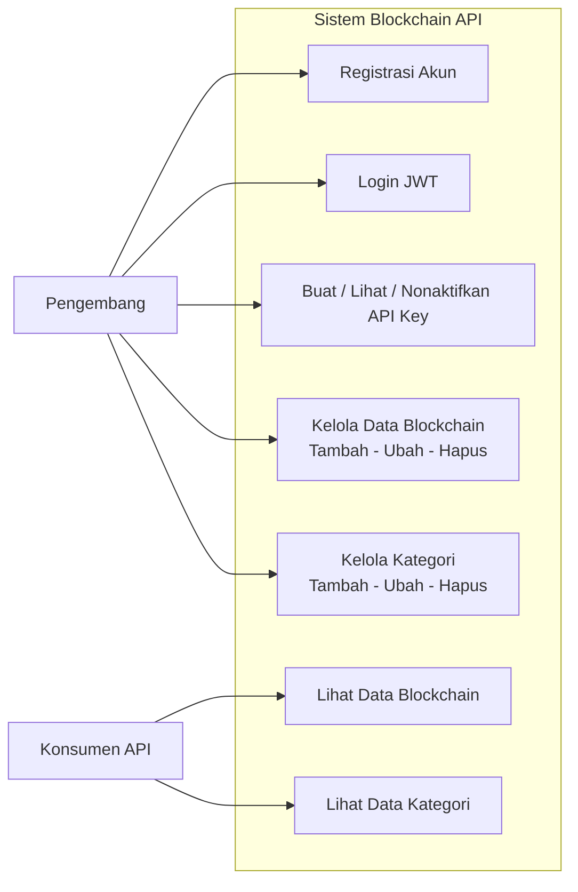
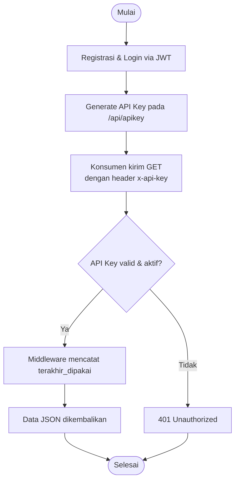
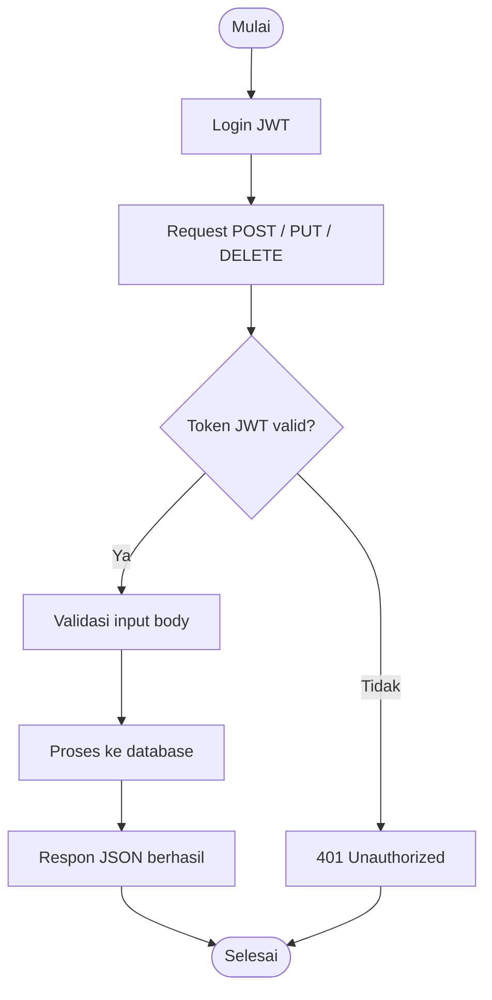
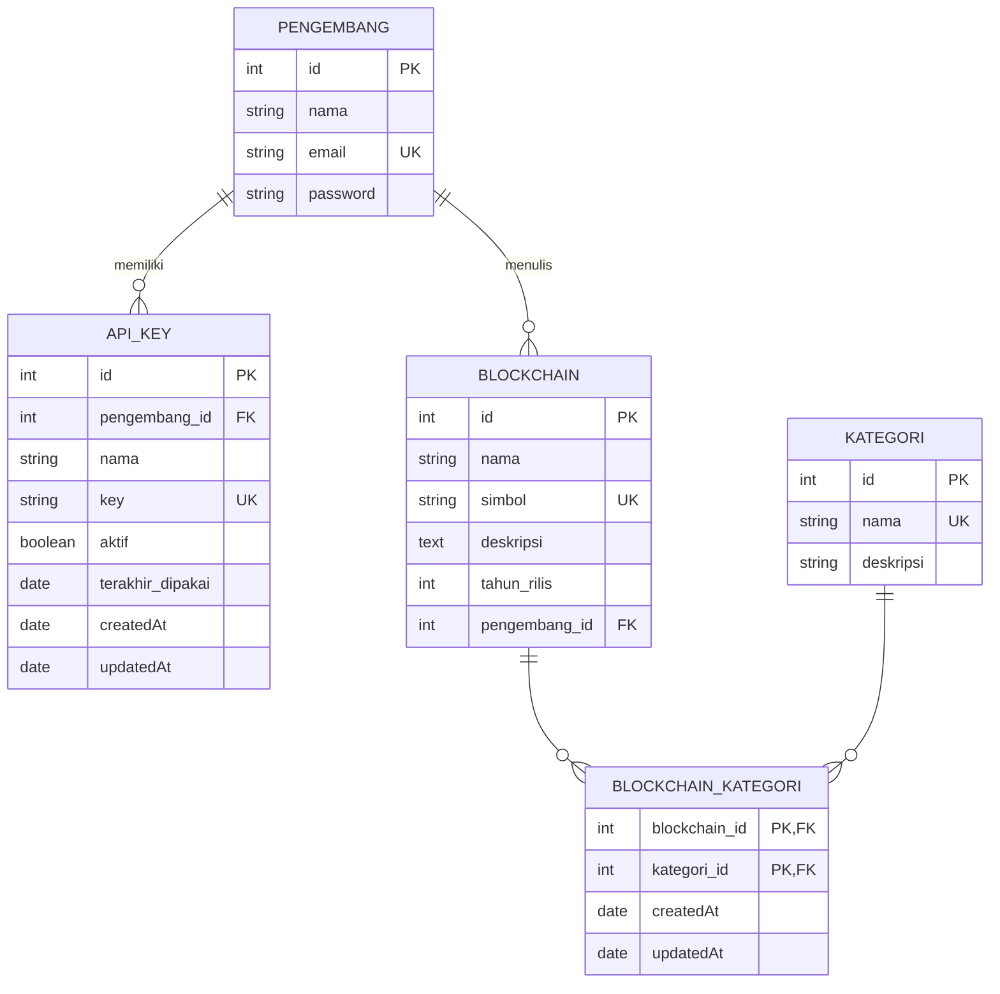

# LAPORAN FINAL PROJECT 236

## Penerapan SaaS API Berbasis Blockchain dengan Express.js, PostgreSQL, dan Vercel

---

**Nama:** (isi nama Anda)
**NIM:** (isi NIM Anda)
**Kelas:** 236
**Mata Kuliah:** Pemrograman Web Service / Final Project

---

## DAFTAR ISI

1. BAB I – Pendahuluan
2. BAB II – Tinjauan Pustaka
3. BAB III – Analisis dan Perancangan Sistem
4. BAB IV – Implementasi
5. BAB V – Pengujian dan Deployment
6. BAB VI – Penutup
7. Daftar Pustaka
8. Lampiran

---

## BAB I PENDAHULUAN

### 1.1 Latar Belakang

Seiring berkembangnya teknologi *blockchain*, kebutuhan akan akses data blockchain
yang cepat, terstruktur, dan aman semakin meningkat. Banyak aplikasi membutuhkan
informasi mengenai aset kripto, kategori teknologi blockchain, serta pengembang di
balik setiap proyek. Sayangnya, data tersebut sering tersebar dan tidak tersedia
dalam bentuk API yang siap pakai.

Untuk menjawab kebutuhan tersebut, pada Final Project ini dikembangkan sebuah
aplikasi **SaaS (Software as a Service)** berupa **Blockchain API** — sebuah REST API
yang menyediakan data blockchain kepada pihak lain (konsumen) dengan menggunakan
**API key**. Model ini serupa dengan layanan OpenRouter atau Weather API, di mana
pengguna mendaftar, melakukan autentikasi dengan **JWT**, memperoleh **API key**, lalu
menggunakan API key tersebut untuk mengakses data.

### 1.2 Rumusan Masalah

1. Bagaimana membangun REST API SaaS yang dapat menyediakan data kepada konsumen dengan API key?
2. Bagaimana mengamankan akses data menggunakan autentikasi JWT dan API key?
3. Bagaimana menyediakan minimal 50 data dengan kompleksitas relasi antar tabel?
4. Bagaimana melakukan deployment aplikasi ke platform Vercel?

### 1.3 Tujuan

1. Membangun Blockchain API dengan arsitektur SaaS (API key-based).
2. Menerapkan autentikasi JWT untuk pengelolaan akun dan API key.
3. Menyediakan data blockchain, kategori, dan pengembang sebanyak 60 data dengan relasi many-to-many.
4. Men-deploy aplikasi ke Vercel agar dapat diakses publik.

### 1.4 Manfaat

- Memberikan akses data blockchain kepada pengembang lain melalui API key.
- Menjadi contoh implementasi SaaS API yang aman dan terdokumentasi.
- Menjadi media pembelajaran penerapan Express.js, Sequelize, PostgreSQL, JWT, dan Vercel.

### 1.5 Batasan Masalah

- API hanya menyediakan data statis yang di-*seed* (belum real-time dari exchange).
- Metode yang diproteksi API key hanya metode **GET** (pembaca data); operasi tulis
  (POST/PUT/DELETE) hanya dapat dilakukan pengembang yang login dengan JWT.
- Database menggunakan PostgreSQL melalui Supabase atau PostgreSQL lokal.

---
## BAB II TINJAUAN PUSTAKA

### 2.1 Software as a Service (SaaS)

SaaS adalah model distribusi perangkat lunak di mana aplikasi di-hosting oleh
penyedia dan diakses melalui internet. Konsumen tidak perlu menginstal atau
memelihara infrastruktur sendiri, cukup berlangganan dan menggunakan layanan.
Pada konteks API, SaaS umumnya menyediakan data/fungsi melalui REST API yang
dilindungi **API key**, contohnya OpenRouter (API AI) dan OpenWeatherMap (API cuaca).

### 2.2 REST API

REST (Representational State Transfer) adalah gaya arsitektur yang memanfaatkan
metode HTTP standar — `GET`, `POST`, `PUT`, `DELETE` — untuk melakukan operasi
terhadap resource yang diidentifikasi oleh URL. Respon umumnya berupa JSON.

### 2.3 JSON Web Token (JWT)

JWT adalah standar token (RFC 7519) yang terdiri dari header, payload, dan
signature. Token ditandatangani dengan secret menggunakan algoritma HS256,
sehingga server dapat memverifikasi keasliannya. Pada aplikasi ini, JWT digunakan
saat login untuk mengelola akun dan API key.

### 2.4 API Key

API key adalah kunci unik yang diberikan kepada konsumen agar dapat mengakses
layanan. Berbeda dengan JWT yang bersifat sementara (expires), API key bersifat
persisten dan di-revoke secara manual. Pada aplikasi ini API key berformat
`blk_<hex>` dan dikirim melalui header `x-api-key`.

### 2.5 Express.js

Express.js adalah framework web minimalis untuk Node.js. Digunakan untuk membuat
server HTTP, mendefinisikan route, dan middleware autentikasi.

### 2.6 PostgreSQL / Supabase

PostgreSQL adalah database relasional open-source yang kuat. **Supabase** adalah
layanan cloud yang menyediakan PostgreSQL terkelola dengan koneksi SSL.
Koneksi database dilakukan melalui library Sequelize (ORM).

### 2.7 Sequelize ORM

Sequelize adalah Object-Relational Mapping untuk Node.js yang mendukung
PostgreSQL. Memudahkan definisi model, relasi, migration, dan seeder tanpa
menulis SQL mentah.

### 2.8 Vercel

Vercel adalah platform *serverless deployment* yang mendukung Node.js. Aplikasi
di-deploy dengan menghubungkan repository GitHub; Vercel akan membangun dan
menjalankan aplikasi secara otomatis pada URL publik.

---

## BAB III ANALISIS DAN PERANCANGAN SISTEM

### 3.1 Analisis Kebutuhan Fungsional

| Kode | Kebutuhan Fungsional |
|---|---|
| F1 | Pengembang dapat melakukan registrasi dan login menggunakan JWT |
| F2 | Pengembang dapat membuat, melihat, dan menonaktifkan API key |
| F3 | Konsumen dapat membaca data blockchain dan kategori menggunakan API key |
| F4 | Pengembang dapat melakukan CRUD data blockchain dan kategori (JWT) |
| F5 | Sistem menyediakan minimal 50 data contoh |

### 3.2 Analisis Kebutuhan Non-Fungsional

| Kode | Kebutuhan |
|---|---|
| NF1 | API merespon dalam format JSON |
| NF2 | Data diakses melalui protokol HTTPS pada deployment Vercel |
| NF3 | Password disimpan dengan hash bcrypt (10 salt rounds) |
| NF4 | Setiap akses tulis wajib autentikasi JWT |
| NF5 | Aplikasi dapat diakses publik melalui URL Vercel |

### 3.3 Use Case Diagram



### 3.4 Activity Diagram / User Flow

**User Flow: Konsumen Mengakses Data dengan API Key**



**Activity Diagram: Pengelolaan Data oleh Pengembang**



---

### 3.5 Entity Relationship Diagram (ERD)



### 3.6 Rancangan Skema Database

Terdapat **5 tabel** (lebih dari syarat minimal 2 tabel):

| Tabel | Kolom Utama | Keterangan |
|---|---|---|
| `pengembang` | id, nama, email, password | Pengguna yang login dengan JWT |
| `api_keys` | id, pengembang_id, nama, key, aktif, terakhir_dipakai | API key konsumen |
| `blockchain` | id, nama, simbol, deskripsi, tahun_rilis, pengembang_id | Data blockchain |
| `kategori` | id, nama, deskripsi | Kategori teknologi blockchain |
| `BlockchainKategori` | blockchain_id, kategori_id | Tabel relasi many-to-many |

Relasi:
- `pengembang` **1–N** `blockchain` (satu pengembang menulis banyak data)
- `pengembang` **1–N** `api_keys` (satu pengembang memiliki banyak key)
- `blockchain` **N–N** `kategori` melalui `BlockchainKategori`

---

## BAB IV IMPLEMENTASI

### 4.1 Teknologi yang Digunakan

| Komponen | Teknologi |
|---|---|
| Backend | Node.js + Express.js 5 |
| Database | PostgreSQL (Supabase) |
| ORM | Sequelize 6 |
| Autentikasi | JWT (jsonwebtoken) + bcrypt |
| API Key | crypto.randomBytes dengan prefix `blk_` |
| Deployment | Vercel |

### 4.2 Struktur Project

```
236_Final Project/
├── config/          # config.js, config.json, db.js
├── controller/      # blockchain, kategori, pengembang, apiKey controller
├── middleware/      # authMiddleware (JWT), apiKeyMiddleware
├── models/          # blockchain, kategori, pengembang, apiKey, index.js
├── routes/          # api.js
├── migrations/      # 5 file migration (skema tabel)
├── seeders/         # 60 data blockchain + 13 kategori + 8 pengembang
├── postman/         # collection API siap import
├── laporan/         # dokumen laporan ini
├── index.js         # entry point Express
└── package.json
```

### 4.3 Implementasi Autentikasi

**Login (JWT):** setelah email & password divalidasi, server membuat token
menggunakan `jwt.sign({ id, nama, email }, JWT_SECRET, { expiresIn })`.

**Middleware JWT (`authMiddleware`):** memverifikasi token pada header
`Authorization: Bearer <token>` untuk seluruh operasi tulis.

**API Key (`apiKeyController`):** pengembang login JWT dapat membuat key baru
melalui `POST /api/apikey`. Key digenerate dengan `crypto.randomBytes(24)` dan
berformat `blk_<hex>`.

**Middleware API Key (`apiKeyMiddleware`):** pada endpoint pembaca (GET),
middleware menerima token JWT **atau** API key dari header `x-api-key`.
Jika API key valid dan aktif, kolom `terakhir_dipakai` diperbarui.

### 4.4 Endpoint API

| Method | Endpoint | Auth | Fungsi |
|---|---|---|---|
| POST | `/api/register` | - | Registrasi pengembang |
| POST | `/api/login` | - | Login & dapatkan JWT |
| POST | `/api/apikey` | JWT | Buat API key |
| GET | `/api/apikey` | JWT | Lihat daftar API key |
| DELETE | `/api/apikey/:id` | JWT | Nonaktifkan API key |
| GET | `/api/blockchain` | API Key/JWT | Ambil data blockchain |
| POST | `/api/blockchain` | JWT | Tambah blockchain |
| PUT | `/api/blockchain/:id` | JWT | Ubah blockchain |
| DELETE | `/api/blockchain/:id` | JWT | Hapus blockchain |
| GET | `/api/kategori` | API Key/JWT | Ambil data kategori |
| POST/PUT/DELETE | `/api/kategori...` | JWT | Kelola kategori |

### 4.5 Data (Seeder)

Seeder menyediakan **60 data blockchain** (Bitcoin, Ethereum, Solana, Polkadot,
Chainlink, dll.), **13 kategori** (Layer 1, Layer 2, DeFi, NFT, Stablecoin, Meme,
GameFi, Metaverse, Oracle, Privacy, Supply Chain, Exchange Token, Interoperability),
**8 pengembang**, dan **81 relasi** many-to-many. Seluruh nama dan simbol
(contoh: BTC, ETH) bersifat unik sehingga memperkaya kompleksitas data.

---

## BAB V PENGUJIAN DAN DEPLOYMENT

### 5.1 Skenario Pengujian

| No | Skenario | Metode | Ekspektasi |
|---|---|---|---|
| 1 | Registrasi pengembang baru | POST `/api/register` | 201, data akun dibuat |
| 2 | Login dengan email & password benar | POST `/api/login` | 200, token JWT |
| 3 | Akses data tanpa token/key | GET `/api/blockchain` | 401 Unauthorized |
| 4 | Buat API key (login JWT) | POST `/api/apikey` | 201, key `blk_...` |
| 5 | Akses data dengan API key | GET `/api/blockchain` + `x-api-key` | 200, data JSON |
| 6 | Akses data dengan API key nonaktif | GET dengan key revoked | 401 |
| 7 | CRUD blockchain dengan JWT | POST/PUT/DELETE | 200/201 sesuai operasi |
| 8 | Migrasi & seed database | `db:migrate`, `db:seed:all` | 60 data masuk |

> Tabel di atas dapat dilengkapi dengan tangkapan layar hasil pengujian
> dari Postman / terminal pada saat presentasi.

### 5.2 Validasi Data Seeder

Hasil validasi otomatis (script): total **60 data blockchain**, **60 simbol unik**,
**8 pengembang**, **13 kategori**, dan **81 relasi Blockchain–Kategori** — seluruh
referensi konsisten dan valid.

### 5.3 Deployment di Vercel

Langkah deployment:

1. Push seluruh kode ke repository GitHub.
2. Buka [vercel.com](https://vercel.com) → **Add New Project** → pilih repository.
3. Vercel otomatis mendeteksi Node.js/Express. Isi environment variables:
   - `POSTGRES_URL` (connection string Supabase/PostgreSQL)
   - `JWT_SECRET` (secret token JWT)
   - `JWT_EXPIRES` (contoh: `1h`)
4. Klik **Deploy**. Aplikasi dapat diakses pada URL publik Vercel.
5. Untuk mengisi data, jalankan seeder terhadap database produksi, atau biarkan
   `sequelize.sync({ alter: true })` membuat tabel otomatis saat aplikasi pertama
   kali berjalan.

URL deployment: **https://236-api-deployment.vercel.app**

---

## BAB VI PENUTUP

### 6.1 Kesimpulan

1. Blockchain API berhasil dibangun sebagai layanan SaaS yang memberikan data
   kepada konsumen melalui **API key**, dengan alur: registrasi → login JWT →
   generate API key → akses data.
2. Autentikasi ganda (JWT untuk pengelolaan, API key untuk konsumsi data)
   berhasil diimplementasikan dan diuji.
3. Data yang disediakan berjumlah **60 record** dengan **5 tabel** dan relasi
   many-to-many, melampaui syarat minimal 50 data.
4. Aplikasi berhasil di-deploy di **Vercel** dan dapat diakses secara publik.

### 6.2 Saran

- Menambahkan sistem kuota & pembatasan laju (rate limiting) per API key.
- Menambahkan halaman dashboard sederhana untuk melihat statistik pemakaian key.
- Menyediakan data real-time melalui integrasi dengan exchange/Crypto API.

---

## DAFTAR PUSTAKA

1. Express.js Documentation. https://expressjs.com
2. Sequelize Documentation. https://sequelize.org
3. JSON Web Tokens (JWT). https://jwt.io
4. PostgreSQL. https://www.postgresql.org
5. Supabase. https://supabase.com
6. Vercel Documentation. https://vercel.com/docs
7. OpenRouter (contoh SaaS API). https://openrouter.ai
8. OpenWeatherMap (contoh API dengan API key). https://openweathermap.org

---

## LAMPIRAN

### A. Link Penting

- **Repository GitHub:** https://github.com/Hugo140804/236_API_Deployment
- **Deployment Vercel:** https://236-api-deployment.vercel.app
- **Postman Collection:** folder `postman/Blockchain_API.postman_collection.json`

### B. Akun Demo Hasil Seeder

| Email | Password | Peran |
|---|---|---|
| andi@blockchain.dev | password123 | Pengembang (punya Demo Key) |
| budi@blockchain.dev | password123 | Pengembang |
| citra@blockchain.dev | password123 | Pengembang |

**API Key Demo:** `blk_demo_andi_236`

### C. Cara Mengubah Laporan Ini Menjadi PDF

Diagram pada laporan ini menggunakan **Mermaid**. Untuk menghasilkan PDF:

1. **Opsi A (VS Code):** install ekstensi *Markdown Preview Enhanced* →
   buka `laporan/LAPORAN.md` → klik kanan → *Chrome (Puppeteer) → PDF*.
2. **Opsi B (GitHub):** buka file di GitHub (diagram otomatis dirender) →
   screenshot diagram → tempel ke Google Docs, lalu ekspor PDF.
3. **Opsi C:** salin kode diagram di folder `laporan/diagrams/*.mmd` ke
   https://mermaid.live → ekspor PNG/SVG → tempel ke dokumen.
4. **Sudah tersedia:** `laporan/diagrams/erd.png` (ERD versi gambar siap tempel).

Unggah PDF hasil konversi ke **Google Drive** dan bagikan link sebagai
pengumpulan laporan Final Project.

